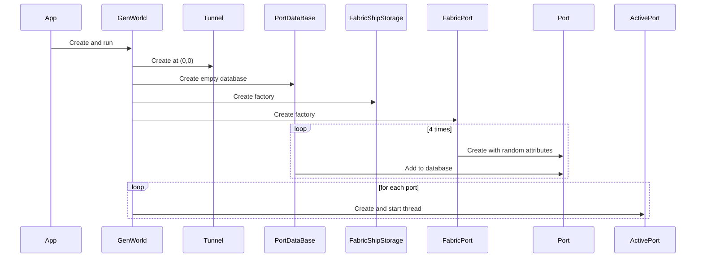
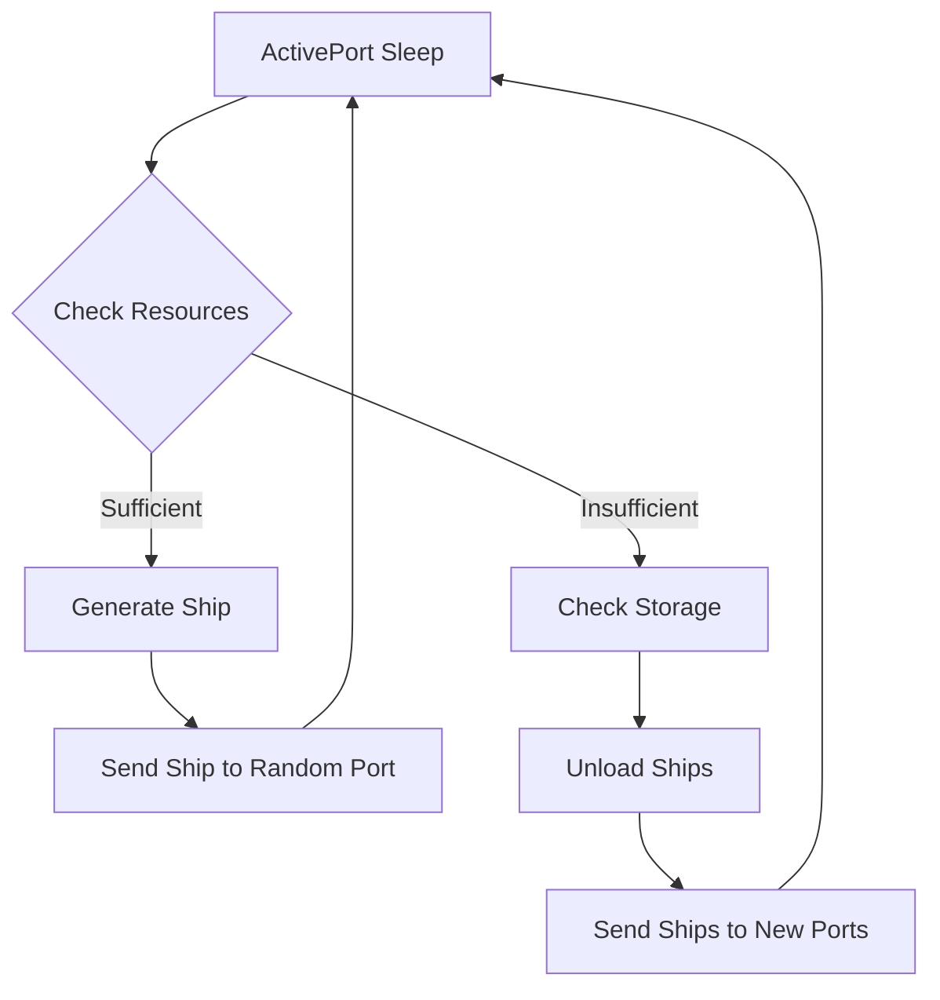
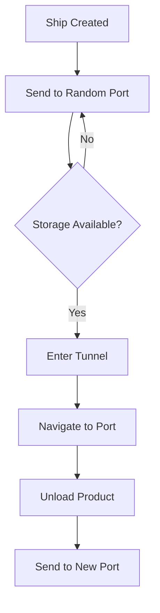
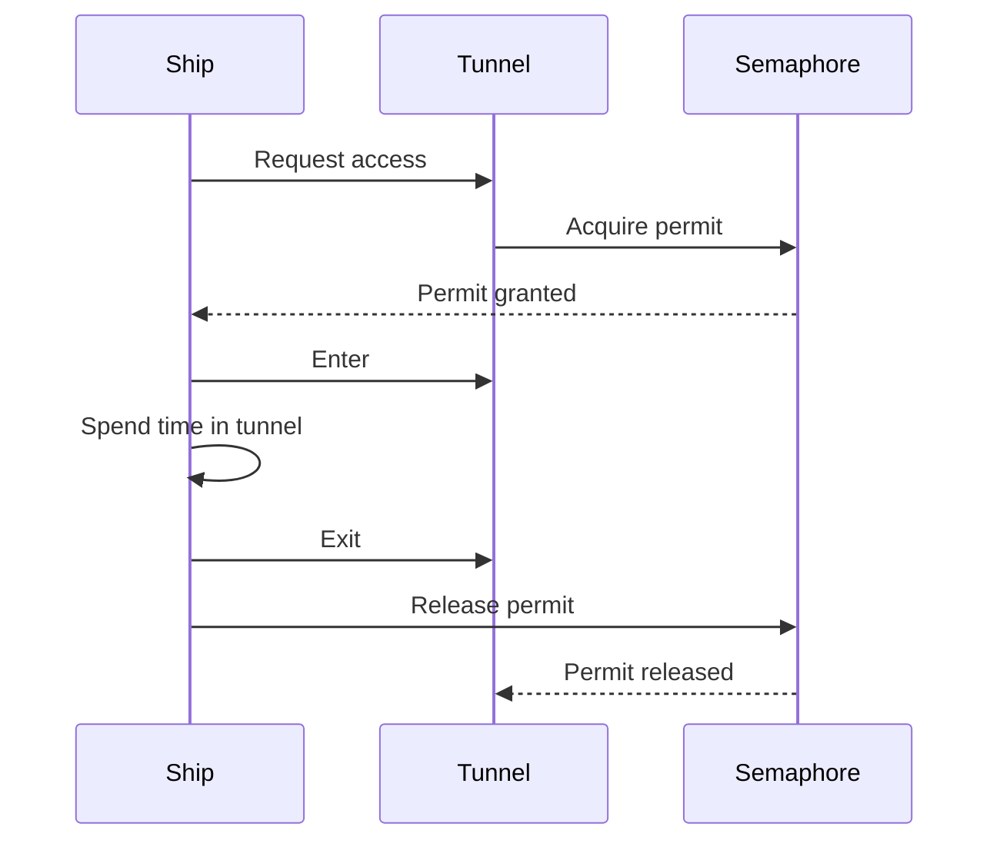

# Technical Documentation: Maritime Transport Simulation System

## Table of Contents
1. [Project Overview](#project-overview)
2. [System Architecture](#system-architecture)
3. [Core Components](#core-components)
4. [Key Functionality](#key-functionality)
5. [Design Patterns](#design-patterns)
6. **Concurrency Model**
7. **Simulation Workflow**
8. **Technical Strengths**
9. **Potential Improvements**
10. **Conclusion**

---

## Project Overview

This Java project simulates a maritime transport system where multiple ports generate ships that travel through a shared tunnel to deliver products. The system demonstrates concurrent operations, resource management, and object-oriented design principles.

Key features:
- Multiple ports generating ships with different capacities
- A tunnel with limited capacity (controlled by semaphore)
- Ships carrying different product types (Gold, Wood, Meat)
- Port storage management for ships of different sizes
- Dynamic ship routing between ports
- Concurrent simulation of all operations

---

## System Architecture

The system follows a layered architecture with clear separation of concerns:

```
┌─────────────────────────────────────────┐
│            Simulation Layer             │
│  ┌─────────────┐  ┌─────────────┐      │
│  │   GenWorld  │  │   App       │      │
│  └─────────────┘  └─────────────┘      │
└─────────────────────────────────────────┘
                    │
┌─────────────────────────────────────────┐
│            Entity Layer                 │
│  ┌─────────────┐  ┌─────────────┐      │
│  │    Port     │  │    Ship     │      │
│  └─────────────┘  └─────────────┘      │
│  ┌─────────────┐  ┌─────────────┐      │
│  │    Tunnel   │  │  Location   │      │
│  └─────────────┘  └─────────────┘      │
└─────────────────────────────────────────┘
                    │
┌─────────────────────────────────────────┐
│          Component Layer                │
│  ┌─────────────┐  ┌─────────────┐      │
│  │ShipStorage  │  │  Product    │      │
│  └─────────────┘  └─────────────┘      │
│  ┌─────────────┐  ┌─────────────┐      │
│  │ShipCapacity │  │PortElements │      │
│  └─────────────┘  └─────────────┘      │
└─────────────────────────────────────────┘
                    │
┌─────────────────────────────────────────┐
│          Factory Layer                 │
│  ┌─────────────┐  ┌─────────────┐      │
│  │ FabricPort  │  │ FabricShip  │      │
│  └─────────────┘  └─────────────┘      │
│  ┌─────────────┐  ┌─────────────┐      │
│  │MultiFabric  │  │   Getter    │      │
│  └─────────────┘  └─────────────┘      │
└─────────────────────────────────────────┘
                    │
┌─────────────────────────────────────────┐
│          Process Layer                  │
│  ┌─────────────┐  ┌─────────────┐      │
│  │ ActivePort  │  │ ShipRoad    │      │
│  └─────────────┘  └─────────────┘      │
│  ┌─────────────┐  ┌─────────────┐      │
│  │SendShip     │  │AppendShip   │      │
│  └─────────────┘  └─────────────┘      │
└─────────────────────────────────────────┘
```

---

## Core Components

### 1. Main Entities

#### Port
- **Purpose**: Represents a maritime port that generates ships and stores products
- **Key Features**:
  - Unique ID and location
  - Product specialization (Gold, Wood, or Meat)
  - Ship storage with capacity for different ship sizes
  - Ship generation capabilities
  - Ship unloading and processing
- **Key Methods**:
  - `getProduct()`: Returns the port's product type
  - `getShipStorage()`: Access to ship storage
  - `getFabricShip()`: Access to ship factory

#### Ship
- **Purpose**: Represents a maritime vessel transporting products
- **Key Features**:
  - Unique ID and location tracking
  - Product cargo
  - Capacity classification (Small, Middle, Big)
  - Creator port identification
- **Key Methods**:
  - `getElements()`: Returns ship components (product and capacity)
  - `getLocation()`: Current ship location
  - `getNameOfCreator()`: Origin port

#### Tunnel
- **Purpose**: Represents a maritime passage with limited capacity
- **Key Features**:
  - Semaphore-controlled access (max 5 ships)
  - Location tracking
- **Key Methods**:
  - `getSemaphore()`: Access to concurrency control mechanism

### 2. Supporting Components

#### ShipStorage
- **Purpose**: Manages ship storage at ports
- **Key Features**:
  - Separate arrays for different ship sizes
  - Capacity management
- **Key Methods**:
  - `getBig()`, `getMiddle()`, `getSmall()`: Access to specific ship arrays
  - `get()`: Returns all ship arrays as a list

#### Product Hierarchy
- **Purpose**: Represents different cargo types
- **Types**:
  - `Gold`: Precious metal cargo
  - `Wood`: Timber cargo
  - `Meat`: Food cargo
- **Key Methods**:
  - `get()`: Retrieve product quantity
  - `set()`: Update product quantity

#### Factory Classes
- **Purpose**: Implement creational patterns for object creation
- **Key Factories**:
  - `FabricPort`: Creates port instances
  - `FabricShip`: Creates ship instances
  - `FabricProduct`: Creates product instances
  - `MultiFabricProduct`: Creates all product types
  - `FabricShipStorage`: Creates ship storage

### 3. Process Controllers

#### ActivePort
- **Purpose**: Manages port operations in a separate thread
- **Key Features**:
  - Periodic ship generation
  - Ship storage monitoring
  - Resource management
- **Key Methods**:
  - `run()`: Main port operation loop

#### ShipRoad
- **Purpose**: Manages ship movement between locations
- **Key Features**:
  - Tunnel navigation
  - Path tracking
  - Thread-safe movement
- **Key Methods**:
  - `run()`: Executes ship journey

---

## Key Functionality

### 1. Port Operations

#### Ship Generation
- Ports generate new ships when they have sufficient resources
- Ships are created with:
  - Unique ID
  - Random product type matching port's specialization
  - Random capacity (Small, Middle, Big)
  - Initial location set to port's location
- Generated ships are immediately sent to another random port

#### Ship Storage Management
- Ports maintain separate storage for different ship sizes
- Storage capacities:
  - Small ships: 2 slots
  - Middle ships: 4 slots
  - Big ships: 8 slots
- Ships are stored based on their capacity classification
- Storage is sorted by ship ID for efficient management

#### Product Unloading
- When ships arrive at ports:
  - Product types are compared
  - Matching products are transferred from ship to port
  - Port's product quantity is increased
  - Ship's product quantity is reset to zero
- Ships are then sent to new destinations

### 2. Ship Operations

#### Tunnel Navigation
- Ships must acquire a semaphore permit before entering the tunnel
- Maximum of 5 ships can be in the tunnel simultaneously
- Ships spend random time (2-8 seconds) in the tunnel
- Semaphore permits are released after exiting

#### Movement Simulation
- Ships move in discrete steps along X and Y axes
- Movement is simulated with 1-second delays per step
- Journey progress is logged with:
  - Current position
  - Destination
  - Target port information

#### Dynamic Routing
- Ships are sent to randomly selected ports
- If destination port has no available storage:
  - Ship is rerouted to another random port
  - Process repeats until storage is found

### 3. System Initialization

#### World Generation
- `GenWorld` initializes the simulation environment:
  - Creates tunnel at origin (0,0)
  - Initializes port database
  - Creates ship storage factory
  - Generates 4 ports with random attributes
  - Starts each port in a separate thread

#### Port Creation
- Ports are created with:
  - Unique ID
  - Random location (0-100 on both axes)
  - Random product specialization
  - Ship storage with standard capacities
  - Ship factory for generation

---

## Design Patterns

### 1. Factory Pattern
- **Implementation**: `FabricPort`, `FabricShip`, `FabricProduct`
- **Purpose**: Centralize object creation logic
- **Benefits**:
  - Decouples client code from concrete classes
  - Simplifies object creation
  - Enables easy extension with new types

### 2. Abstract Factory Pattern
- **Implementation**: `MultiFabricProduct`, `MultiFabricShipCapacity`
- **Purpose**: Create families of related objects
- **Benefits**:
  - Ensures compatibility between created objects
  - Simplifies creation of multiple related objects
  - Promotes consistency

### 3. Strategy Pattern
- **Implementation**: `ShipCapacityGetter`, `ShipProductGetter`
- **Purpose**: Encapsulate algorithms for extracting ship components
- **Benefits**:
  - Flexible selection of extraction strategies
  - Easy to add new extraction methods
  - Clean separation of concerns

### 4. Builder Pattern
- **Implementation**: `FabricShip` with `prepareElements()` and `prepareShip()`
- **Purpose**: Construct complex objects step by step
- **Benefits**:
  - Clear construction process
  - Encapsulates complex creation logic
  - Improves code readability

### 5. Observer Pattern (Implicit)
- **Implementation**: Port operations trigger ship movements
- **Purpose**: Enable loose coupling between components
- **Benefits**:
  - Components react to state changes without tight coupling
  - Supports dynamic event handling

---

## Concurrency Model

### 1. Thread Management
- **Port Threads**: Each port runs in its own thread (`ActivePort`)
- **Ship Threads**: Each ship journey runs in a separate thread
- **Tunnel Access**: Controlled by semaphore to limit concurrent access

### 2. Synchronization Mechanisms
- **Semaphore**: Controls tunnel access (max 5 ships)
- **Thread Join**: Ensures sequential execution of tunnel entry and movement
- **Thread Sleep**: Simulates real-time operations

### 3. Concurrency Challenges Addressed
- **Resource Contention**: Tunnel access managed via semaphore
- **Race Conditions**: Ship storage operations are atomic
- **Deadlock Prevention**: Semaphore timeouts and proper release in finally blocks
- **Thread Safety**: Shared resources accessed in controlled manner

### 4. Concurrent Processes
1. **Port Operations**: Continuous generation and processing of ships
2. **Ship Movement**: Independent navigation between ports
3. **Tunnel Transit**: Controlled passage through shared resource
4. **Product Transfer**: Synchronized unloading at destinations

---

## Simulation Workflow

### 1. Initialization Phase


### 2. Port Operation Cycle


### 3. Ship Journey


### 4. Tunnel Navigation


---

## Technical Strengths

### 1. Object-Oriented Design
- Clear separation of concerns with well-defined classes
- Proper encapsulation of data and behavior
- Effective use of inheritance and interfaces
- Polymorphic behavior for different ship and product types

### 2. Design Pattern Implementation
- Multiple patterns appropriately applied
- Patterns improve code maintainability and extensibility
- Clear mapping between problems and pattern solutions

### 3. Concurrency Handling
- Effective thread management for independent operations
- Proper synchronization for shared resources
- Prevention of common concurrency issues
- Realistic simulation of parallel processes

### 4. Extensibility
- Easy to add new product types
- Simple to modify ship capacities
- Straightforward to adjust tunnel parameters
- Flexible port configuration options

### 5. Simulation Realism
- Time-based operations with realistic delays
- Random elements to simulate unpredictability
- Resource constraints mirroring real-world limitations
- Dynamic routing and decision-making

---

## Potential Improvements

### 1. Technical Enhancements
- **Thread Pool Management**: Replace individual thread creation with thread pool
- **Concurrent Collections**: Use thread-safe collections for shared data structures
- **Configuration Management**: Externalize simulation parameters
- **Logging Framework**: Implement structured logging instead of System.out
- **Exception Handling**: Add comprehensive error handling and recovery

### 2. Functional Extensions
- **Visual Interface**: Add GUI to visualize simulation
- **Performance Metrics**: Collect and display simulation statistics
- **Event System**: Implement proper event-driven architecture
- **Persistence**: Save and restore simulation state
- **Dynamic Configuration**: Allow runtime parameter adjustment

### 3. Simulation Realism
- **Weather Effects**: Add environmental factors affecting ship movement
- **Economic Model**: Implement supply/demand dynamics
- **Port Specialization**: Create ports with specific roles
- **Ship Maintenance**: Add wear and maintenance requirements
- **Route Optimization**: Implement intelligent pathfinding

### 4. Code Quality
- **Unit Testing**: Add comprehensive test coverage
- **Documentation**: Enhance inline documentation
- **Refactoring**: Simplify complex methods
- **Code Standards**: Enforce consistent formatting and naming
- **Dependency Injection**: Reduce coupling between components
